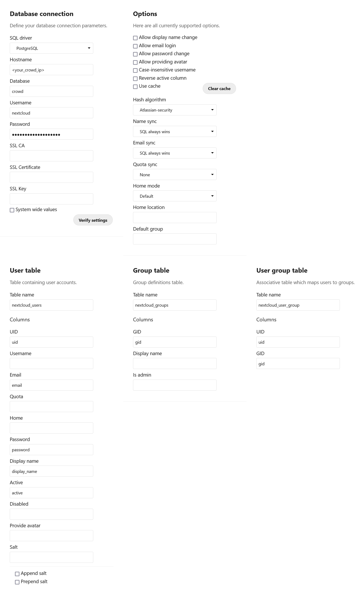

# Configuring Nextcloud

The main tool we're using to stitch together Crowd and Nextcloud is the [User and Group SQL Backends](https://apps.nextcloud.com/apps/user_sql) app. Start by installing it on your Nextcloud instance.

Make sure that Python and Pip are installed on your system. After that, execute `pip install passlib`.

Find a comfortable directory in your system (here we'll use `/home/atlassian-password`) and copy files [getPasswordHash.py](getPasswordHash.py) and [checkPassword.py](checkPassword.py) into it.

Find your Nextcloud installation directory (usually `/var/www/nextcloud`) and copy [Atlassian.php](Atlassian.php) into `<nextcloud_installation>/apps/user_sql/lib/Crypto`. Note that this action will have to be repeated every time that *user_sql* is updated. Make sure to replace `/home/atlassian-password` in the file with whichever path you had chosen on the previous step.

Finally, configure the *User and Group SQL Backends* app as follows, but with your own IP and password:

